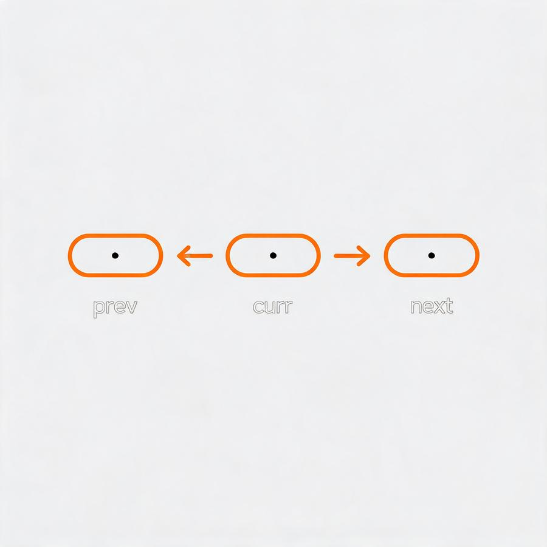

## 双指针

**对撞 · 快慢 · 同向 —— O(n²) → O(n)**


两个指针协同遍历数据结构，将暴力 O(n²) 降为 O(n)。对撞指针左右夹逼、快慢指针一快一慢、同向指针同步推进——三种变体覆盖大多数线性遍历问题。

| 变体 | 原理 | 代表题 |
|------|------|--------|
| 对撞指针 | l=0, r=n-1，根据条件移动 l 或 r | 盛最多水的容器、三数之和 |
| 快慢指针 | slow 走 1 步，fast 走 2 步 | 环形链表、回文链表 |
| 同向双指针 | slow 维护边界，fast 探索 | 移动零、删除重复项 |

```python
# 对撞指针
l, r = 0, len(arr) - 1
while l < r:
    if condition:
        l += 1
    else:
        r -= 1

# 快慢指针
slow = fast = head
while fast and fast.next:
    slow = slow.next
    fast = fast.next.next
```

> **金句**：双指针就是让两个人协同干活——一个人傻跑就是暴力。

**ML 关联**：对撞指针的贪心收敛 ↔ 梯度下降的迭代逼近；滑动窗口 ↔ CNN 卷积核滑动。

---

## 链表技巧

**反转 · 判环 · 找中点 · 哑节点 —— 别丢**



链表题六个核心操作，记住一个字：**别丢**。反转时先存 next，判环用快慢指针，相交链表走相同总路程，合并用哑节点统一边界。

| 变体 | 原理 | 代表题 |
|------|------|--------|
| 反转链表 | 三指针 prev / curr / nxt，先存再转 | 206-反转链表 |
| Floyd 判圈 | 快慢指针，有环必相遇 | 141、142-环形链表 |
| 消除长度差 | 两指针走 A→B 和 B→A | 160-相交链表 |
| 哑节点 | 虚拟头节点统一边界 | 21-合并两个有序链表 |

```python
# 反转链表
prev, curr = None, head
while curr:
    nxt = curr.next   # 先保存！
    curr.next = prev
    prev, curr = curr, nxt
return prev

# Floyd 判圈
s = f = head
while f and f.next:
    s = s.next
    f = f.next.next
    if s == f: return True
```

> **金句**：链表题就一个字：别丢。next 先存好，怎么玩都行。

**ML 关联**：链表指针操作 ↔ 计算图梯度反向传播（链式追踪）。

---

## 哈希表

**空间换时间 · O(1) 查找 · set / dict**

用 O(1) 查找替代 O(n) 遍历，典型「空间换时间」策略。互补查找、存在性判断、频率统计——三个模式覆盖大部分哈希场景。

| 变体 | 原理 | 代表题 |
|------|------|--------|
| 互补查找 | 遍历时查 target−num 是否在表中 | 1-两数之和 |
| 存在性判断 | 所有元素放入 set，O(1) 判定 | 128-最长连续序列 |
| 频率统计 | dict 统计出现次数 | 3-无重复字符的最长子串 |

```python
# 两数之和
seen = {}
for i, num in enumerate(nums):
    if target - num in seen:
        return [seen[target-num], i]
    seen[num] = i
```

> **金句**：用一点空间，把 O(n²) 变成 O(n)。

---

## 滑动窗口

**固定窗口 · 可变窗口 —— 只进不退 O(n)**

维护 [l, r] 区间在数组上滑动。l 和 r 都只进不退，保证 O(n)。遇错就收左边，对了就扩右边。

| 变体 | 原理 | 代表题 |
|------|------|--------|
| 固定窗口 | 窗口大小固定，整体右移 | 438-字母异位词 |
| 可变窗口 | r 扩张，l 收缩保持窗口性质 | 3-无重复字符的最长子串 |

```python
l = 0; window = set()
for r in range(len(s)):
    while s[r] in window:
        window.remove(s[l]); l += 1
    window.add(s[r])
    ans = max(ans, r - l + 1)
```

> **金句**：窗口只大不小，遇错就收左边。

---

## 排序与去重

**排序 → 双指针 · 跳过重复 · 剪枝**

排序本身 O(n log n)，但能让后续操作从 O(n²) 降到 O(n)。排序是双指针的最佳搭档。

```python
nums.sort()
for i in range(len(nums)):
    if i > 0 and nums[i] == nums[i-1]: continue
    l, r = i + 1, len(nums) - 1
    while l < r:
        s = nums[i] + nums[l] + nums[r]
        if s == 0:
            res.append([nums[i], nums[l], nums[r]])
            while l<r and nums[l]==nums[l+1]: l+=1
            while l<r and nums[r]==nums[r-1]: r-=1
            l += 1; r -= 1
        elif s < 0: l += 1
        else: r -= 1
```

> **金句**：排序是双指针的好搭档——有序才能让指针有方向。

---

## 递归与回溯

**选 / 不选 + 剪枝 —— 排列组合**

回溯 = 试错。每一步做选择 → 递归 → 撤销选择。关键是「剪枝」提前终止无效路径。

| 变体 | 原理 | 代表题 |
|------|------|--------|
| 子集型 | 每个元素选或不选 | 78-子集 |
| 排列型 | 穷举全排列，used 标记 | 46-全排列 |
| 组合型 | start 参数控制不重复 | 77-组合 |

```python
def backtrack(path, choices):
    if 满足结束条件:
        res.append(path[:]); return
    for choice in choices:
        if 不合法: continue
        path.append(choice)
        backtrack(path, new_choices)
        path.pop()
```

> **金句**：往前走不通就回头换一条路。

---

## 动态规划

**状态定义 + 转移方程 · 最优子结构**

大问题拆小问题，存中间结果。三步：定义状态 → 转移方程 → 初始化边界。

```python
dp = [0] * (n + 1)
dp[0] = dp[1] = 1
for i in range(2, n + 1):
    dp[i] = dp[i-1] + dp[i-2]
```

> **金句**：记住你算过的东西，别重复劳动。

---

## 二分查找

**有序区间折半 · O(log n)**

每次排除一半搜索空间。核心：选对 while 条件和开闭区间。

```python
l, r = 0, len(nums) - 1
while l <= r:
    mid = (l + r) // 2
    if nums[mid] == target: return mid
    elif nums[mid] < target: l = mid + 1
    else: r = mid - 1
return -1
```

> **金句**：二分不是猜数字——是每次砍掉一半。

---

## 树的遍历

**前中后序 / BFS+DFS —— 递归三行**

前序（根左右）、中序（左根右）、后序（左右根）是 DFS；层序用队列是 BFS。

```python
def inorder(root):
    if not root: return
    inorder(root.left)
    res.append(root.val)
    inorder(root.right)
```

> **金句**：递归三行搞定遍历——想不明白就画图。

---

## 栈与队列

**LIFO / FIFO · 最近相关性**

栈解决「最近相关性」（括号匹配、单调栈），队列解决「先进先出」。

```python
stack = []
pairs = {')': '(', '}': '{', ']': '['}
for c in s:
    if c in pairs:
        if not stack or stack.pop() != pairs[c]:
            return False
    else:
        stack.append(c)
return not stack
```

> **金句**：后来的先配对，配不上的留着等——消消乐。
